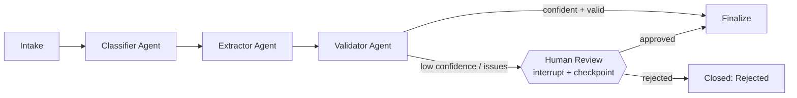

# AgentFlow

[](https://github.com/harshpatel262/agentflow/actions/workflows/ci.yml)

**Multi-agent workflow orchestration engine for business process automation**, built on [LangGraph](https://github.com/langchain-ai/langgraph) and FastAPI.

AgentFlow takes unstructured business documents (invoices, purchase orders, contracts, support requests) and runs them through a supervised pipeline of specialized AI agents — classification, structured extraction, validation — with **human-in-the-loop approval gates** for anything the agents are not confident about.

The design goal: straight-through automation when the system is sure, a paused, auditable workflow waiting for a person when it isn't. That property is what makes agentic automation deployable against real business processes.


*(recorded with [VHS](https://github.com/charmbracelet/vhs) from [docs/demo.tape](docs/demo.tape) — reproducible against a mock-mode server)*

## Architecture



- **Agents are pure functions over shared state.** Each agent reads context, calls the LLM through a narrow `LLMClient` protocol, and returns a partial state update plus an audit entry. No agent knows about HTTP, storage, or other agents.
- **Human-in-the-loop via graph interrupts.** Low-confidence or invalid results trigger a LangGraph `interrupt` before the review node. The workflow checkpoints and waits — for minutes or days — until a reviewer posts a decision, then resumes exactly where it stopped.
- **Full audit trail.** Every agent appends to an additive `audit` reducer; the complete decision history of any workflow is reconstructable from its checkpoints.
- **Provider-agnostic LLM layer.** Anthropic Claude by default; the `LLMClient` protocol plus a deterministic `MockLLM` mean the entire engine (and test suite) runs with no API key and no network.

## API

| Method | Path | Purpose |
|---|---|---|
| `POST` | `/workflows` | Run a document through the pipeline (synchronous) |
| `POST` | `/workflows/stream` | Same, streaming each agent's progress as Server-Sent Events |
| `GET` | `/workflows/{id}` | Current state, including pending-review status and audit trail |
| `POST` | `/workflows/{id}/decision` | Approve/reject a paused workflow; execution resumes from checkpoint |
| `GET` | `/health` | Liveness |

### Example

```bash
# start a workflow
curl -s localhost:8000/workflows \
  -H 'Content-Type: application/json' \
  -d '{"document": "Invoice INV-1042 from Acme Corp. Amount due: $1,875.50 USD by 2026-07-01."}'

# => {"status": "completed", "category": "invoice",
#     "extraction": {"vendor": "Acme Corp", "invoice_number": "INV-1042", ...},
#     "audit": [{"agent": "intake", ...}, {"agent": "classifier", ...}, ...]}

# resolve a workflow that paused for review
curl -s localhost:8000/workflows/<id>/decision \
  -H 'Content-Type: application/json' \
  -d '{"approved": true, "notes": "verified against PO"}'
```

## Quickstart

```bash
git clone https://github.com/harshpatel262/agentflow && cd agentflow
python3 -m venv .venv && source .venv/bin/activate
pip install -e ".[dev]"

# with a real model
export AGENTFLOW_ANTHROPIC_API_KEY=sk-ant-...
# or fully offline with the deterministic mock LLM
export AGENTFLOW_MOCK_MODE=true

uvicorn agentflow.api.main:app --reload
```

Run the tests (no API key needed):

```bash
pytest -v
```

Or with Docker:

```bash
docker build -t agentflow . && docker run -p 8000:8000 -e AGENTFLOW_MOCK_MODE=true agentflow
```

## Configuration

| Variable | Default | Description |
|---|---|---|
| `AGENTFLOW_ANTHROPIC_API_KEY` | — | Anthropic API key |
| `AGENTFLOW_MODEL` | `claude-sonnet-4-6` | Model used by all agents |
| `AGENTFLOW_REVIEW_CONFIDENCE_THRESHOLD` | `0.80` | Below this classification confidence, route to human review |
| `AGENTFLOW_MOCK_MODE` | `false` | Force the deterministic mock LLM |

## Design notes

- **Why LangGraph over a hand-rolled state machine?** Checkpointing and interrupts. Pausing mid-workflow for an out-of-band human decision, then resuming days later with full state, is exactly the hard part of process automation — and exactly what graph checkpoints give for free.
- **Why JSON-only agent contracts?** Agents communicate through typed state, not free-form messages. LLM responses are parsed defensively (`parse_json_response`) and validated before routing decisions are made on them.
- **Rule-based first, LLM-enhanced second.** Routing (confidence thresholds, validation gates) is deterministic code. The LLM supplies judgment inside nodes; it never controls the graph topology.

## Roadmap

- [ ] Postgres checkpointer for durable multi-instance deployments
- [ ] Pluggable workflow definitions (YAML → graph) for new business processes
- [ ] Reviewer web UI for the human-in-the-loop queue
- [ ] LangSmith tracing integration & per-agent evaluation suites

## License

MIT
